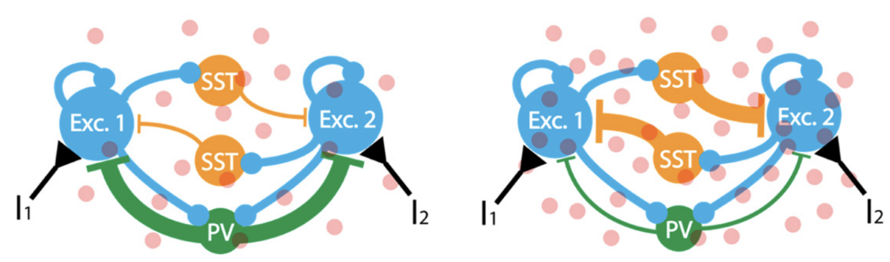

# Neural-Mass-Decision-Making-Model
Stability analysis of a neural-mass model of the prefrontal circuits for decision-making. Based on the paper: [Amil, A. F., & Verschure, P. F. (2021). Supercritical dynamics at the edge-of-chaos underlies optimal decision-making. Journal of Physics: Complexity, 2(4), 045017](https://iopscience.iop.org/article/10.1088/2632-072X/ac3ad2/meta).

